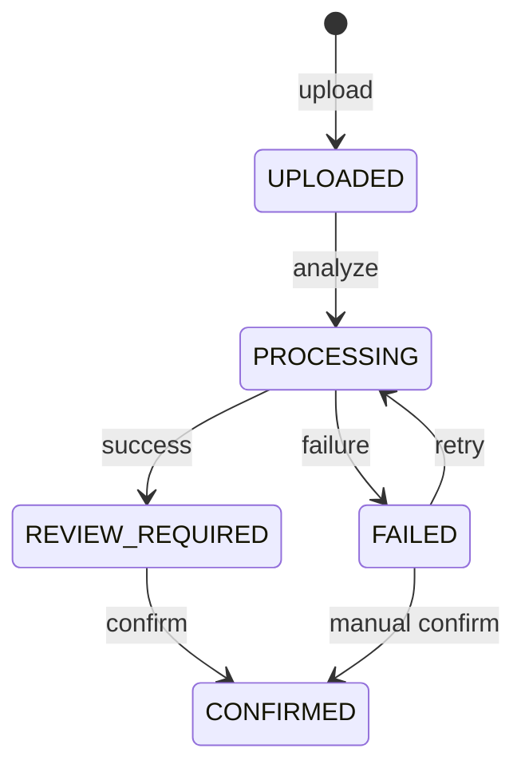

# 06. ERD

## 목적과 범위

MAIRRY MVP의 PostgreSQL 논리 모델과 무결성 규칙을 정의한다. AI 추출값은 사용자가 확인하기
전까지 미확정 데이터이며 금융 계산에는 사용하지 않는다.

## 관계도

```mermaid
erDiagram
    USER ||--o| WEDDING_PLAN : owns
    USER ||--o{ DOCUMENT : uploads
    WEDDING_PLAN ||--o{ CONTRACT : contains
    DOCUMENT ||--o| CONTRACT : confirmed_as
    CONTRACT ||--o{ PAYMENT : has

    USER {
      uuid id PK
      varchar display_name
      timestamptz created_at
      timestamptz updated_at
    }
    WEDDING_PLAN {
      uuid id PK
<<<<<<< HEAD
      uuid user_id FK, UK
=======
      uuid user_id FK_UK
>>>>>>> 90910e1153772b532e4aad84be43df85c47b7179
      date wedding_date
      bigint available_asset
      timestamptz created_at
      timestamptz updated_at
    }
    DOCUMENT {
      uuid id PK
      uuid user_id FK
      varchar original_name
      varchar storage_key UK
      varchar mime_type
      bigint size_bytes
      varchar status
      jsonb extraction_result
      varchar analysis_source
      varchar error_code
      varchar error_message
      timestamptz created_at
      timestamptz updated_at
    }
    CONTRACT {
      uuid id PK
      uuid wedding_plan_id FK
<<<<<<< HEAD
      uuid document_id FK, UK
=======
      uuid document_id FK_UK
>>>>>>> 90910e1153772b532e4aad84be43df85c47b7179
      varchar document_type
      varchar company
      bigint total_price
      jsonb cancellation_terms
      varchar status
      timestamptz confirmed_at
      timestamptz created_at
      timestamptz updated_at
    }
    PAYMENT {
      uuid id PK
      uuid contract_id FK
      varchar name
      bigint amount
      date due_date
      varchar payment_status
      text source_text
      integer display_order
      timestamptz created_at
      timestamptz updated_at
    }
```

## 테이블 정의

### USER

| 컬럼 | 타입 | Null | 제약/설명 |
|---|---|---:|---|
| id | UUID | N | PK |
| display_name | VARCHAR(100) | N | 표시명 |
| created_at | TIMESTAMPTZ | N | 생성 시각, UTC 저장 |
| updated_at | TIMESTAMPTZ | N | 수정 시각, UTC 저장 |

MVP에서는 `DEMO_USER_ID` 한 명을 사용하지만 모든 조회는 이 사용자 범위를 강제한다. 클라이언트가
`userId`를 전달하지 않는다.

### WEDDING_PLAN

| 컬럼 | 타입 | Null | 제약/설명 |
|---|---|---:|---|
| id | UUID | N | PK |
| user_id | UUID | N | FK → USER.id, UNIQUE |
| wedding_date | DATE | N | 결혼 예정일 |
| available_asset | BIGINT | N | `>= 0`, 원 단위 |
| created_at | TIMESTAMPTZ | N | 생성 시각 |
| updated_at | TIMESTAMPTZ | N | 수정 시각 |

사용자당 계획은 최대 한 개다. `PUT /wedding-plan`은 `user_id` 유일키를 기준으로 생성 또는 갱신한다.

### DOCUMENT

| 컬럼 | 타입 | Null | 제약/설명 |
|---|---|---:|---|
| id | UUID | N | PK |
| user_id | UUID | N | FK → USER.id |
| original_name | VARCHAR(255) | N | 표시용 원본명, 저장소 키로 사용 금지 |
| storage_key | VARCHAR(512) | N | 서버 생성 비공개 객체 키, UNIQUE |
| mime_type | VARCHAR(100) | N | PDF/JPEG/PNG |
| size_bytes | BIGINT | N | `> 0`, 업로드 제한 검증값 |
| status | VARCHAR(30) | N | DocumentStatus |
| extraction_result | JSONB | Y | AI 추출 원본 스냅샷 |
| analysis_source | VARCHAR(30) | Y | `LIVE_AI`, `DEMO_FALLBACK` |
| error_code | VARCHAR(100) | Y | 분석 실패 코드 |
| error_message | VARCHAR(500) | Y | 개인정보 없는 사용자용 오류 |
| created_at | TIMESTAMPTZ | N | 생성 시각 |
| updated_at | TIMESTAMPTZ | N | 수정 시각 |

`extraction_result`는 `contracts/ai-extraction.schema.json`을 통과해야 한다. 사용자 수정값으로 이
스냅샷을 덮어쓰지 않고, 확정값은 CONTRACT와 PAYMENT에 저장한다.

### CONTRACT

| 컬럼 | 타입 | Null | 제약/설명 |
|---|---|---:|---|
| id | UUID | N | PK |
| wedding_plan_id | UUID | N | FK → WEDDING_PLAN.id |
| document_id | UUID | N | FK → DOCUMENT.id, UNIQUE |
| document_type | VARCHAR(30) | N | `WEDDING_HALL`, `UNKNOWN` |
| company | VARCHAR(200) | N | 공백 문자열 금지 |
| total_price | BIGINT | N | `>= 0`, 원 단위 |
| cancellation_terms | JSONB | N | `{summary, sourceText}` 배열 |
| status | VARCHAR(30) | N | MVP 저장값 `CONFIRMED` |
| confirmed_at | TIMESTAMPTZ | N | 사용자 확정 시각 |
| created_at | TIMESTAMPTZ | N | 생성 시각 |
| updated_at | TIMESTAMPTZ | N | 수정 시각 |

검수 중 값은 DOCUMENT와 클라이언트 편집 상태에 유지한다. CONTRACT는 확정 트랜잭션에서만
생성하므로 MVP DB에 DRAFT 행을 만들지 않는다. 문서 하나는 최대 한 계약으로 확정된다.

### PAYMENT

| 컬럼 | 타입 | Null | 제약/설명 |
|---|---|---:|---|
| id | UUID | N | PK |
| contract_id | UUID | N | FK → CONTRACT.id |
| name | VARCHAR(100) | N | 공백 문자열 금지 |
| amount | BIGINT | Y | null 또는 `>= 0`, 원 단위 |
| due_date | DATE | Y | 지급일 미확인 시 null |
| payment_status | VARCHAR(20) | N | `PAID`, `UNPAID`, `UNKNOWN` |
| source_text | TEXT | N | 계약 원문 근거, 없으면 빈 문자열 |
| display_order | INTEGER | N | `>= 0`, 원문/검수 순서 |
| created_at | TIMESTAMPTZ | N | 생성 시각 |
| updated_at | TIMESTAMPTZ | N | 수정 시각 |

금융 계산에는 `CONTRACT.status = CONFIRMED`, `payment_status = UNPAID`, `amount IS NOT NULL`인
항목만 포함한다. `due_date IS NULL`인 항목도 합계에는 포함하지만 날짜순 타임라인에서는 확인 필요
영역으로 분리한다.

## 상태 전이



- PROCESSING 재분석, REVIEW_REQUIRED 재분석, CONFIRMED 재확정은 409 대상이다.
- CONFIRMED 전환과 Contract·Payment 생성은 하나의 트랜잭션이다.
- 실패 시 Contract나 Payment 일부가 남아서는 안 된다.

## 무결성과 인덱스

필수 제약:

- `UNIQUE wedding_plan(user_id)`
- `UNIQUE document(storage_key)`
- `UNIQUE contract(document_id)`
- 금액은 0 이상, `document.size_bytes`는 0보다 큰 CHECK
- 상태 컬럼은 DB enum 또는 CHECK로 허용값 제한
- 확정 시 WeddingPlan과 Document의 사용자 소유권 일치 검증

권장 인덱스:

- `document(user_id, created_at DESC)`
- `contract(wedding_plan_id, status)`
- `payment(contract_id, payment_status, due_date)`

## 삭제와 보존

MVP 공개 API에는 삭제가 없다. 운영상 삭제가 필요하면 원본 객체와 DB 메타데이터를 함께 처리하고,
확정 데이터는 Payment → Contract → Document 순서로 명시적으로 삭제한다. User 또는 WeddingPlan의
무조건 CASCADE 삭제는 금지한다.

## 저장하지 않는 파생값

- `remainingExpense = SUM(확정 계약의 금액이 있는 UNPAID payment.amount)`
- `expectedBalance = availableAsset - remainingExpense`
- `nearestPayment = 지급일이 있는 대상 중 기준일 이후 가장 이른 항목`
- `shortageAmount = MAX(0, -simulatedExpectedBalance)`

시뮬레이션은 요청별로 계산하며 원본 계획과 지급항목을 변경하지 않는다.
