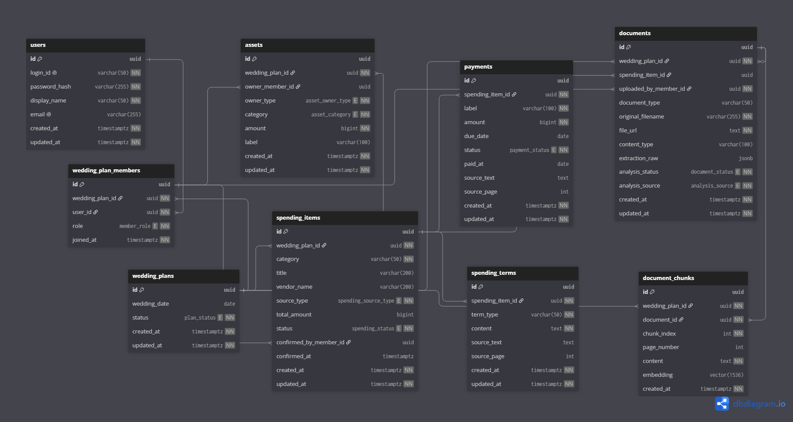
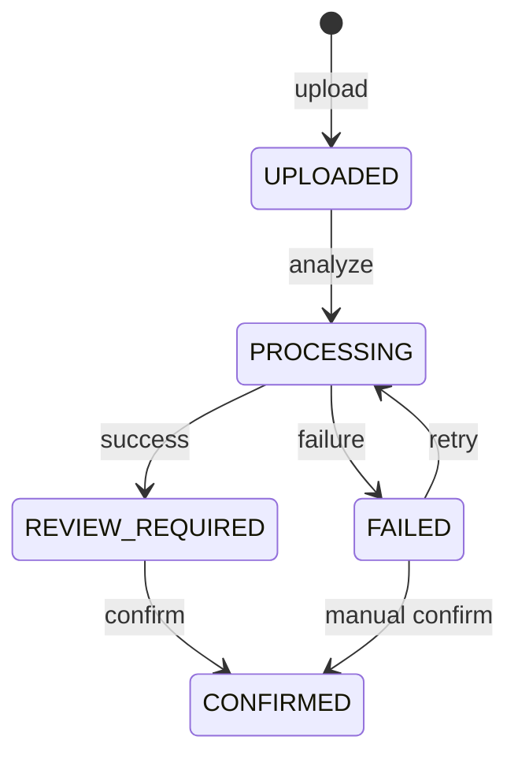

# 06. ERD



| 영역 | 역할 |
| --- | --- |
| `users` | 실제 로그인 사용자 |
| `wedding_plans` | 두 사람이 공유하는 결혼 준비 공간 |
| `wedding_plan_members` | 사용자와 WeddingPlan 연결 |
| `assets` | 결혼 준비에 사용할 자금 |
| `contracts` | 사용자가 검수·확정한 계약 단위 |
| `payments` | 계약금·중도금·잔금 등 실제 지급 일정 |
| `cancellation_terms` | 취소·환불 등 계약조건과 근거 |
| `documents` | 원본 계약서/견적서와 AI 분석 결과 |
| `document_chunks` | 계약서 RAG 검색용 데이터 |

## 테이블 명세서
## users

### 역할

서비스에 가입하고 로그인하는 **개별 사용자**를 저장한다.

결혼을 두 사람이 함께 준비하더라도 하나의 계정을 공유하지 않고 각각 자신의 계정을 가진다.

```
USER A ─┐
        ├─ WeddingPlan
USER B ─┘
```

### 테이블 명세

| 컬럼 | 타입 | NULL | 제약조건 | 설명 |
| --- | --- | --- | --- | --- |
| `id` | UUID | X | PK | 사용자 식별자 |
| `login_id` | VARCHAR(50) | X | UNIQUE | 로그인 ID |
| `password_hash` | VARCHAR(255) | X | - | 암호화된 비밀번호 |
| `display_name` | VARCHAR(50) | X | - | 사용자 표시 이름 |
| `email` | VARCHAR(255) | O | UNIQUE | 사용자 이메일 |
| `created_at` | TIMESTAMPTZ | X | DEFAULT now() | 가입일 |
| `updated_at` | TIMESTAMPTZ | X | DEFAULT now() | 정보 수정일 |

### 특징

BCrypt 등을 이용한 Hash를 저장한다.

```
password_hash = "$2a$10$..." ✅
```

Spring Security를 사용한다면 `BCryptPasswordEncoder`를 사용할 수 있다.

---

## wedding_plans

### 역할

서비스에서 가장 중요한 **최상위 도메인**이다.

한 쌍의 예비부부가 준비하고 있는 하나의 결혼을 의미한다.

```
WeddingPlan

├─ 두 명의 사용자
├─ 자산
├─ 웨딩홀
├─ 스드메
├─ 가전
├─ 계약서
├─ 지급일정
└─ AI 검색 범위
```

### 테이블 명세

| 컬럼 | 타입 | NULL | 제약조건 | 설명 |
| --- | --- | --- | --- | --- |
| `id` | UUID | X | PK | 결혼계획 식별자 |
| `wedding_date` | DATE | O | - | 결혼 예정일 |
| `status` | ENUM | X | DEFAULT ACTIVE | 결혼계획 상태 |
| `created_at` | TIMESTAMPTZ | X | DEFAULT now() | 생성일 |
| `updated_at` | TIMESTAMPTZ | X | DEFAULT now() | 수정일 |

#### `status`

| 값 | 의미 |
| --- | --- |
| `ACTIVE` | 결혼 준비 진행 중 |
| `COMPLETED` | 결혼 완료 |

### 특징

wedding_plans에 `user_id`를 직접 넣지 않는 것이 핵심이다.

```
wedding_plans.user_id ❌
```

결혼 계획에는 두 사람이 참여하므로 별도의 wedding_plan_members에서 연결한다.

---

## wedding_plan_members

### 역할

`User`와 `WeddingPlan` 사이의 N:M 관계를 관리한다.

```
User A
   \
    WeddingPlan
   /
User B
```

### 테이블 명세

| 컬럼 | 타입 | NULL | 제약조건 | 설명 |
| --- | --- | --- | --- | --- |
| `id` | UUID | X | PK | WeddingPlan Member 식별자 |
| `wedding_plan_id` | UUID | X | FK | 참여 WeddingPlan |
| `user_id` | UUID | X | FK | 참여 사용자 |
| `role` | ENUM | X | - | OWNER / PARTNER |
| `joined_at` | TIMESTAMPTZ | X | DEFAULT now() | 참여일 |

### UNIQUE

```text
(wedding_plan_id, user_id)
```

동일 사용자가 같은 WeddingPlan에 중복 참여하는 것을 방지한다.

### `role`

| 값 | 설명 |
| --- | --- |
| `OWNER` | WeddingPlan 최초 생성자 |
| `PARTNER` | 상대방 사용자 |

#### 특징

`HUSBAND`, `WIFE`처럼 성별을 기준으로 설계하지 않는다.

또한 **WeddingPlan당 최대 2명**이라는 제한은 MVP에서는 DB Constraint보다는 서비스 로직에서 검증하는 것을 권장한다.

```
if (memberCount>=2) {
	thrownewWeddingPlanMemberLimitException();
}
```

---

## assets

### 역할

예비부부가 **결혼 준비에 실제 사용할 수 있는 자금**을 저장한다.

예:

```
본인 현금        2,000만원
본인 예적금      1,500만원
파트너 현금      1,000만원
공동 결혼통장    1,500만원

총 가용자금      6,000만원
```

### 테이블 명세

| 컬럼 | 타입 | NULL | 제약조건 | 설명 |
| --- | --- | --- | --- | --- |
| `id` | UUID | X | PK | 자산 식별자 |
| `wedding_plan_id` | UUID | X | FK | WeddingPlan |
| `owner_member_id` | UUID | O | FK | PERSONAL이면 필수, JOINT이면 NULL |
| `owner_type` | ENUM | X | CHECK | PERSONAL / JOINT |
| `category` | ENUM | X | - | CASH / SAVINGS |
| `amount` | BIGINT | X | CHECK >= 0 | 자산 금액 |
| `label` | VARCHAR(100) | O | - | 사용자 지정 이름 |
| `created_at` | TIMESTAMPTZ | X | DEFAULT now() | 생성일 |
| `updated_at` | TIMESTAMPTZ | X | DEFAULT now() | 수정일 |

### `owner_type`

| 값 | 의미 |
| --- | --- |
| `PERSONAL` | 한 명에게 속한 자산 |
| `JOINT` | 두 사람의 공동 자산 |

### `category`

| 값 | 의미 |
| --- | --- |
| `CASH` | 현금성 자산 |
| `SAVINGS` | 예·적금 |

### 특징

MVP에서는 `월소득`, `대출`을 이 테이블에 섞지 않는 것이 좋다.

왜냐하면:

```
현금/예적금 → 자산
월소득      → 현금 흐름
대출        → 부채
```

로 의미가 다르기 때문이다.

향후 금융기능 확대 시 `incomes`, `liabilities`를 추가할 수 있다.

### 무결성 제약

```sql
CHECK (
  (owner_type = 'PERSONAL' AND owner_member_id IS NOT NULL)
  OR
  (owner_type = 'JOINT' AND owner_member_id IS NULL)
)
```

또한 개인 자산의 `owner_member_id`는 반드시 해당 `asset.wedding_plan_id`와 동일한 WeddingPlan 소속이어야 하며, 이 일치 여부는 서비스 레이어에서 검증한다.

---

## contracts

### 역할

AI 추출값을 사용자가 검수한 뒤 확정한 **하나의 계약**을 표현한다.

이 테이블이 결혼비용 관리의 핵심이다.

예:

```
WeddingPlan
 ├─ 웨딩홀 계약
 └─ 향후 스드메 계약
```

### 테이블 명세

| 컬럼 | 타입 | NULL | 제약조건 | 설명 |
| --- | --- | --- | --- | --- |
| `id` | UUID | X | PK | 계약 식별자 |
| `wedding_plan_id` | UUID | X | FK | WeddingPlan |
| `document_id` | UUID | X | FK, UNIQUE | 확정 원본 Document |
| `document_type` | VARCHAR(50) | X | - | 문서 종류, MVP는 WEDDING_HALL |
| `company` | VARCHAR(200) | X | - | 업체명 |
| `total_price` | BIGINT | X | CHECK >= 0 | 계약 총액 |
| `status` | ENUM | X | DEFAULT CONFIRMED | 계약 상태 |
| `confirmed_by_member_id` | UUID | O | FK | AI 결과 검수 사용자 |
| `confirmed_at` | TIMESTAMPTZ | X | - | 확정일 |
| `created_at` | TIMESTAMPTZ | X | DEFAULT now() | 생성일 |
| `updated_at` | TIMESTAMPTZ | X | DEFAULT now() | 수정일 |

#### `status`

| 값 | 설명 |
| --- | --- |
| `CONFIRMED` | 사용자 검수 완료 |

### 특징

MVP에서는 확정 생성과 목록·상세 조회만 제공한다. 계약 수정·삭제와 Payment 상태 변경 API는
제공하지 않는다. 검수자는 반드시 해당 계약과 동일한 WeddingPlan 소속이어야 하며, 이 일치
여부는 서비스 레이어에서 검증한다.

---

## payments

#### 역할

하나의 Contract에서 발생하는 **실제 지급 일정**을 저장한다.

예를 들어 웨딩홀 총비용이 2,300만 원이라면:

```
웨딩홀 23,000,000

├─ 계약금
│   3,000,000
│   PAID
│
└─ 잔금
    20,000,000
    2027-04-30
    UNPAID
```

### 테이블 명세

| 컬럼 | 타입 | NULL | 제약조건 | 설명 |
| --- | --- | --- | --- | --- |
| `id` | UUID | X | PK | 지급항목 식별자 |
| `contract_id` | UUID | X | FK | 소속 Contract |
| `name` | VARCHAR(100) | X | - | 계약금/중도금/잔금 등 |
| `amount` | BIGINT | X | NOT NULL, CHECK >= 0 | 사용자가 확정한 지급금액 |
| `due_date` | DATE | O | - | 지급 예정일 |
| `status` | ENUM | X | DEFAULT UNPAID | 지급 상태 |
| `source_text` | TEXT | O | - | 해당 정보를 추출한 원문 |
| `created_at` | TIMESTAMPTZ | X | DEFAULT now() | 생성일 |
| `updated_at` | TIMESTAMPTZ | X | DEFAULT now() | 수정일 |

### `status`

| 값 | 설명 |
| --- | --- |
| `UNPAID` | 미지급 |
| `PAID` | 지급 완료 |
| `UNKNOWN` | 지급 상태 확인 필요 |

### 특징

AI 추출 결과의 `amount`는 NULL일 수 있지만 Contract의 Payment로 저장하기 전 사용자가 0 이상의
정수 금액을 입력해야 한다. NULL 금액은 검수 화면에서 확인 필요로 표시하고 확정을 차단한다.
값을 추측하거나 `total_price`에서 역산하지 않는다.

AI 추출 근거가 있는 Payment는 `source_text`를 보존한다. FAILED 문서의 직접입력처럼 AI 근거가
없는 Payment는 `source_text = NULL`로 저장하며 빈 근거를 생성하지 않는다.

이 테이블을 기준으로 **Wedding Financial Timeline**을 만들 수 있다.

```
ORDERBY due_date
```

또한 남은 지출 계산도 여기서 한다.

```
SUM(UNPAID payments)
```

---

## cancellation_terms

#### 역할

계약서 또는 견적서에 존재하는 **금액 이외의 중요한 조건**을 저장한다.

예:

- 취소조건
- 환불조건
- 위약금
- 보증인원
- 인원 변경기한
- 추가비용
- 식사 조건

### 테이블 명세

| 컬럼 | 타입 | NULL | 제약조건 | 설명 |
| --- | --- | --- | --- | --- |
| `id` | UUID | X | PK | 계약조건 식별자 |
| `contract_id` | UUID | X | FK | 소속 Contract |
| `summary` | TEXT | X | - | 취소조건 요약 |
| `source_text` | TEXT | O | - | 계약서 원문 |
| `created_at` | TIMESTAMPTZ | X | DEFAULT now() | 생성일 |
| `updated_at` | TIMESTAMPTZ | X | DEFAULT now() | 수정일 |

#### 예시

```
summary
예식 90일 전까지 취소 시 계약금 전액 환불

source_text
계약일로부터 예식 90일 전까지 취소 시 계약금을 전액 환불한다.

```

### 특징

`contracts.cancellation_policy`처럼 하나의 TEXT 필드에 모든 조건을 넣지 않는다.
FAILED 문서에서 사용자가 직접 입력한 조건은 AI 근거가 없으므로 `source_text = NULL`을 허용한다.

따라서 향후:

> "보증인원 몇 명이야?"
> 

> "취소조건 알려줘."
> 

> "추가비용 조건 있어?"
> 

같은 AI 질문을 더 쉽게 처리할 수 있다.

---

## documents

### 역할

사용자가 업로드하는 **원본 계약서 또는 견적서**와 AI 최초 분석결과를 관리한다.

실제 PDF/JPG/PNG 파일 자체는 Object Storage에 저장하고 DB에는 경로를 저장한다.

### 테이블 명세

| 컬럼 | 타입 | Null | 제약/설명 |
|---|---|---:|---|
| id | UUID | N | PK |
| wedding_plan_id | UUID | N | FK → WEDDING_PLAN.id |
| document_id | UUID | N | FK → DOCUMENT.id, UNIQUE |
| document_type | VARCHAR(30) | N | `WEDDING_HALL`, `UNKNOWN` |
| company | VARCHAR(200) | N | 공백 문자열 금지 |
| total_price | BIGINT | N | `>= 0`, 원 단위 |
| cancellation_terms | JSONB | N | `{summary, sourceText}` 배열 |
| status | VARCHAR(30) | N | MVP 저장값 `CONFIRMED` |
| confirmed_at | TIMESTAMPTZ | N | 사용자 확정 시각 |
| created_at | TIMESTAMPTZ | N | 생성 시각 |
| updated_at | TIMESTAMPTZ | N | 수정 시각 |

검수 중 값은 DOCUMENT와 클라이언트 편집 상태에 유지한다. CONTRACT는 확정 트랜잭션에서만
생성하므로 MVP DB에 DRAFT 행을 만들지 않는다. 문서 하나는 최대 한 계약으로 확정된다.

### PAYMENT

| 컬럼 | 타입 | Null | 제약/설명 |
|---|---|---:|---|
| id | UUID | N | PK |
| contract_id | UUID | N | FK → CONTRACT.id |
| name | VARCHAR(100) | N | 공백 문자열 금지 |
| amount | BIGINT | Y | null 또는 `>= 0`, 원 단위 |
| due_date | DATE | Y | 지급일 미확인 시 null |
| payment_status | VARCHAR(20) | N | `PAID`, `UNPAID`, `UNKNOWN` |
| source_text | TEXT | N | 계약 원문 근거, 없으면 빈 문자열 |
| display_order | INTEGER | N | `>= 0`, 원문/검수 순서 |
| created_at | TIMESTAMPTZ | N | 생성 시각 |
| updated_at | TIMESTAMPTZ | N | 수정 시각 |

금융 계산에는 `CONTRACT.status = CONFIRMED`, `payment_status = UNPAID`, `amount IS NOT NULL`인
항목만 포함한다. `due_date IS NULL`인 항목도 합계에는 포함하지만 날짜순 타임라인에서는 확인 필요
영역으로 분리한다.

## 상태 전이



- PROCESSING 재분석, REVIEW_REQUIRED 재분석, CONFIRMED 재확정은 409 대상이다.
- CONFIRMED 전환과 Contract·Payment 생성은 하나의 트랜잭션이다.
- 실패 시 Contract나 Payment 일부가 남아서는 안 된다.

## 무결성과 인덱스

필수 제약:

- `UNIQUE wedding_plan(user_id)`
- `UNIQUE document(storage_key)`
- `UNIQUE contract(document_id)`
- 금액은 0 이상, `document.size_bytes`는 0보다 큰 CHECK
- 상태 컬럼은 DB enum 또는 CHECK로 허용값 제한
- 확정 시 WeddingPlan과 Document의 사용자 소유권 일치 검증

권장 인덱스:

- `document(user_id, created_at DESC)`
- `contract(wedding_plan_id, status)`
- `payment(contract_id, payment_status, due_date)`

## 삭제와 보존

MVP 공개 API에는 삭제가 없다. 운영상 삭제가 필요하면 원본 객체와 DB 메타데이터를 함께 처리하고,
확정 데이터는 Payment → Contract → Document 순서로 명시적으로 삭제한다. User 또는 WeddingPlan의
무조건 CASCADE 삭제는 금지한다.

## 저장하지 않는 파생값

- `remainingExpense = SUM(확정 계약의 금액이 있는 UNPAID payment.amount)`
- `expectedBalance = availableAsset - remainingExpense`
- `nearestPayment = 지급일이 있는 대상 중 기준일 이후 가장 이른 항목`
- `shortageAmount = MAX(0, -simulatedExpectedBalance)`

시뮬레이션은 요청별로 계산하며 원본 계획과 지급항목을 변경하지 않는다.
